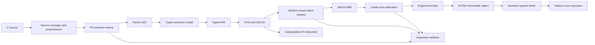

# Architecture

Source files are arranged by invariants rather than by generated framework layers. `source/source.*` owns immutable input and locations; `token.*` and `lex.*` own token identity; `pp.*` owns macro state; `type.*`, `ast.*`, `parser.*`, and `sema.*` own the typed frontend; `ir.*` and `ir_verify.*` own the representation; `opt.*` and `regalloc.*` own transformations and location validity; `x86_64.*` and `elf64.*` own native output; `driver.*` and `inspect.*` own user-facing orchestration.

The current architecture records contracts before each incomplete boundary is promoted to a complete feature. In particular, a frontend-only parse result is never treated as a native compiler result, and a requested unsupported construct is a fatal diagnostic rather than an omitted AST node.
